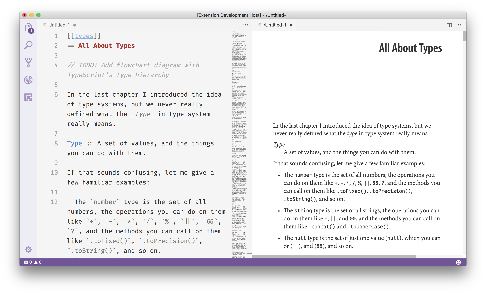

# Better AsciiDoc (alpha)

Live preview, syntax highlighting, and symbols for AsciiDoc. Preview formats your Asciidoc as an Orielly book.

## Installation

Search for `better-asciidoctor-vscode` in the VSCode extensions tab.

## Usage

Just open any file with a `.adoc` or `.asciidoc` extension, and preview will automatically open for you.

## Inspired by

https://github.com/joaompinto/asciidoctor-vscode
